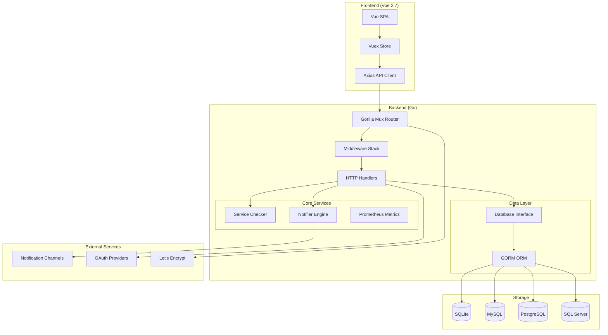
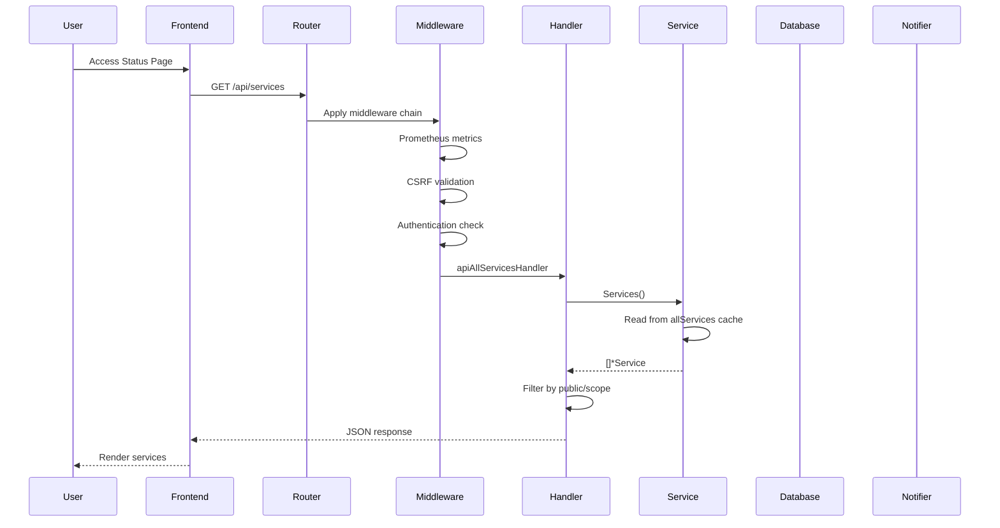
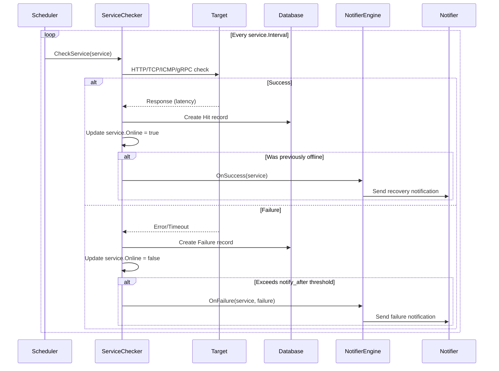
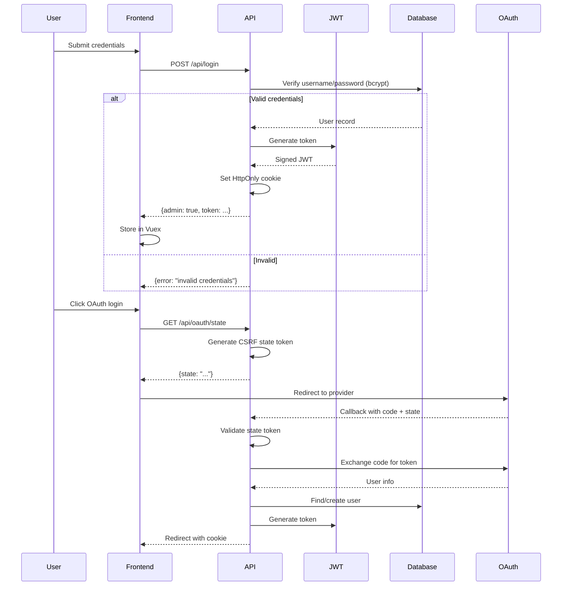

# Statping-ng Architecture

## Overview

Statping-ng is an open-source status page and monitoring application written in Go (backend) with a Vue.js frontend. It monitors HTTP, TCP, UDP, ICMP, gRPC, SMTP, IMAP, and command-based services, providing uptime statistics, failure tracking, and multi-channel notifications.

---

## Architecture and Design Choices

### High-Level Architecture



### Design Principles

1. **Database Agnostic**: Abstract database layer via custom `Database` interface wrapping GORM, supporting SQLite, MySQL, PostgreSQL, and SQL Server with dialect-specific optimizations.

2. **Plugin-Based Notifiers**: Each notification channel (Slack, Discord, Email, etc.) implements the `ServiceNotifier` interface, enabling easy addition of new channels.

3. **Embedded Assets**: Frontend assets are embedded using `go.rice` for single-binary deployment, with optional runtime asset override via `/assets` directory.

4. **Stateless Authentication**: JWT-based authentication with HTTP-only cookies, supporting OAuth providers (GitHub, Google, Slack, custom OIDC).

5. **Read-Only Mode**: Database operations respect a `READ_ONLY` flag for read-replica deployments.

### Assumptions

| Assumption | Rationale |
|------------|-----------|
| Single instance per database | No distributed locking; service checks run on the local instance |
| UTC timezone for all timestamps | Consistent time handling across time zones |
| SQLite for development/small deployments | Auto-selected when no `DB_CONN` specified |
| HTTPS termination at proxy | TLS certificate management via Let's Encrypt or reverse proxy |
| Service check intervals ≥ 1 second | Prevents tight polling loops |

### Edge Cases

| Edge Case | Handling |
|-----------|----------|
| Database unavailable at startup | Enters "Setup Mode" to configure connection |
| Service check timeout | Recorded as failure with timeout error |
| Notifier API failure | Logged and retried based on notifier limits |
| OAuth state token expiry | 10-minute TTL with automatic cleanup |
| Large hit/failure datasets | Chunked queries (100 for SQLite, 3000 for MySQL/PostgreSQL) |
| Concurrent service updates | `sync.RWMutex` on `allServices` map |

### Performance and Efficiency

| Optimization | Implementation |
|--------------|----------------|
| Connection pooling | GORM's built-in pool with configurable limits |
| Batch inserts | Dialect-aware chunk sizes for bulk operations |
| In-memory service cache | `allServices` map avoids repeated DB queries |
| Lazy-loaded relations | Preload only when needed (N+1 prevention) |
| Prometheus metrics collection | Background goroutine every 5 seconds |
| Old record cleanup | Daily maintenance routine deletes stale hits/failures |
| Frontend code splitting | Webpack chunks for dashboard vs public pages |

---

## Data Flow and Control Logic

### Operational Flow



### Service Check Flow



### Authentication Flow



### Code Relations

```
cmd/main.go
├── start() → Initialization entry point
│   ├── source.Assets() → Load/extract embedded assets
│   ├── utils.InitLogs() → Configure logging
│   ├── configs.LoadConfigs() → Read config.yml
│   ├── configs.ConnectConfigs() → Establish DB connection
│   ├── configs.MigrateDatabase() → Run migrations
│   └── mainProcess()
│       ├── InitApp()
│       │   ├── core.Select() → Load core settings
│       │   ├── metrics.InitMetrics() → Register Prometheus collectors
│       │   ├── notifiers.InitNotifiers() → Register all notifiers
│       │   ├── services.SelectAllServices() → Load services to cache
│       │   └── services.CheckServices() → Start check goroutines
│       └── handlers.RunHTTPServer() → Start HTTP server

handlers/routes.go
├── Router() → Build route tree
│   ├── prometheusMiddleware → Request metrics
│   ├── apiMiddleware → JSON response headers
│   ├── csrfMiddleware → CSRF protection
│   ├── authenticated() → JWT validation
│   └── scoped() → Field-level access control

types/services/
├── struct.go → Service model definition
├── database.go → DB operations (Find, Create, Update, Delete)
├── methods.go → Business logic (UptimeData, UpdateStats)
├── check_*.go → Service check implementations
└── routine.go → Background check scheduler

notifiers/
├── notifiers.go → Notifier registry
├── *.go → Individual notifier implementations
└── generate.go → Code generation for form fields
```

---

## Dependencies

### Go Modules (Backend)

| Category | Module | Version | Purpose |
|----------|--------|---------|---------|
| **Web Framework** | `github.com/gorilla/mux` | 1.8.1 | HTTP router |
| **Database** | `gorm.io/gorm` | 1.31.2 | ORM |
| | `gorm.io/driver/sqlite` | 1.6.0 | SQLite driver |
| | `gorm.io/driver/mysql` | 1.6.0 | MySQL driver |
| | `gorm.io/driver/postgres` | 1.6.0 | PostgreSQL driver |
| | `gorm.io/driver/sqlserver` | 1.6.3 | SQL Server driver |
| **Authentication** | `github.com/golang-jwt/jwt/v5` | 5.3.1 | JWT tokens |
| | `golang.org/x/oauth2` | 0.36.0 | OAuth 2.0 client |
| | `golang.org/x/crypto` | 0.54.0 | bcrypt password hashing |
| **Monitoring** | `github.com/prometheus/client_golang` | 1.24.0 | Prometheus metrics |
| | `github.com/go-ping/ping` | 1.2.0 | ICMP ping |
| | `google.golang.org/grpc` | 1.82.1 | gRPC health checks |
| **Notifications** | `github.com/go-mail/mail` | 2.3.1 | SMTP email |
| | `github.com/aws/aws-sdk-go-v2` | 1.43.0 | AWS SNS |
| **TLS** | `github.com/foomo/simplecert` | 1.8.8 | Let's Encrypt automation |
| **Utilities** | `github.com/spf13/cobra` | 1.10.2 | CLI framework |
| | `github.com/spf13/viper` | 1.21.0 | Configuration |
| | `github.com/sirupsen/logrus` | 1.9.4 | Structured logging |
| | `gopkg.in/natefinch/lumberjack.v2` | 2.2.1 | Log rotation |
| **Assets** | `github.com/GeertJohan/go.rice` | 1.0.3 | Asset embedding |
| | `github.com/tdewolff/minify/v2` | 2.24.13 | CSS/JS minification |
| **Error Tracking** | `github.com/getsentry/sentry-go` | 0.48.0 | Error reporting |

### NPM Packages (Frontend)

| Category | Package | Version | Purpose |
|----------|---------|---------|---------|
| **Framework** | `vue` | 2.7.16 | UI framework |
| | `vue-router` | 3.6.5 | Client-side routing |
| | `vuex` | 3.6.2 | State management |
| **HTTP** | `axios` | 0.33.0 | API client |
| **Charts** | `apexcharts` | 3.48.0 | Data visualization |
| | `vue-apexcharts` | 1.6.2 | Vue wrapper |
| **Security** | `dompurify` | 3.0.6 | XSS sanitization |
| **UI** | `@fortawesome/vue-fontawesome` | 0.1.10 | Icons |
| | `vuedraggable` | 2.24.3 | Drag-and-drop |
| | `codemirror` | 5.65.18 | Code editor |
| **i18n** | `vue-i18n` | 8.28.2 | Internationalization |
| **Dates** | `date-fns` | 2.30.0 | Date utilities |
| **Build** | `webpack` | 4.47.0 | Module bundler |
| | `sass` | 1.101.7 | CSS preprocessor |

### External Services

| Service | Usage | Configuration |
|---------|-------|---------------|
| **Database** | Data persistence | `config.yml` or env vars |
| **SMTP Server** | Email notifications | Notifier settings |
| **Slack API** | Slack notifications | Webhook URL |
| **Discord API** | Discord notifications | Webhook URL |
| **Telegram API** | Telegram notifications | Bot token + chat ID |
| **Twilio API** | SMS notifications | Account SID + auth token |
| **Pushover API** | Push notifications | App token + user key |
| **AWS SNS** | AWS notifications | IAM credentials |
| **GitHub OAuth** | Social login | Client ID + secret |
| **Google OAuth** | Social login | Client ID + secret |
| **Slack OAuth** | Social login | Client ID + secret |
| **Let's Encrypt** | TLS certificates | Domain + email |

### System Requirements

| Requirement | Minimum | Recommended |
|-------------|---------|-------------|
| **Go** | 1.21+ | 1.26+ |
| **Node.js** | 18+ | 20+ |
| **RAM** | 128 MB | 512 MB |
| **Disk** | 100 MB | 1 GB (with SQLite) |
| **OS** | Linux, macOS, Windows | Linux (systemd) |

### Build Tools

| Tool | Purpose |
|------|---------|
| `go build` | Compile Go binary |
| `rice embed-go` | Embed frontend assets |
| `npm run build` | Build frontend bundle |
| `dart-sass` | Compile SCSS (optional, for custom themes) |
| `xz` | Decompress test fixtures |
| `MinGW` | CGO compilation on Windows |

---

## Configuration

### Environment Variables

| Variable | Default | Description |
|----------|---------|-------------|
| `DB_CONN` | sqlite | Database type (sqlite, mysql, postgres, mssql) |
| `DB_HOST` | localhost | Database host |
| `DB_PORT` | varies | Database port |
| `DB_USER` | - | Database username |
| `DB_PASS` | - | Database password |
| `DB_DATABASE` | statping | Database name |
| `SERVER_IP` | 0.0.0.0 | Listen address |
| `SERVER_PORT` | 8080 | Listen port |
| `BASE_PATH` | - | URL path prefix |
| `READ_ONLY` | false | Disable write operations |
| `DISABLE_LOGS` | false | Disable request logging |
| `DEBUG` | false | Enable pprof profiling |

### Configuration File (config.yml)

```yaml
connection: sqlite
db_host: localhost
db_port: 5432
db_user: statping
db_pass: secretpassword
db_name: statping
api_key: auto-generated
language: en
allow_reports: true
```

---

## Security Architecture

### Authentication Layers

1. **JWT Tokens**: Signed with HMAC-SHA256 using API secret
2. **HTTP-Only Cookies**: Prevents XSS token theft
3. **CSRF Protection**: Double-submit cookie pattern with X-CSRF-Token header
4. **Rate Limiting**: 5 login attempts per 5 minutes per IP
5. **OAuth State Tokens**: CSRF protection for OAuth flows
6. **bcrypt**: Password hashing with cost factor 14

### Access Control

| Scope | Access Level |
|-------|--------------|
| `public` | Unauthenticated access |
| `user` | Authenticated non-admin |
| `admin` | Full access |

Private fields (marked with `private:"true"` or `scope:"user,admin"`) are stripped from responses for unauthenticated requests.

---

*Last Updated: 2026-07-25*
